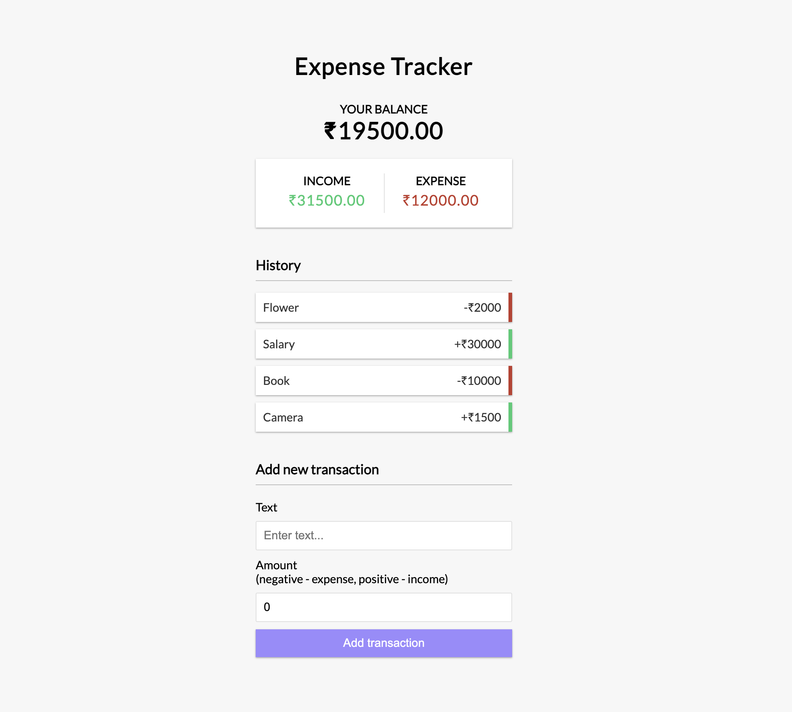

# Expense Tracker

Check your expenses & income here.

**React Concept Used:**

- React Hooks
- Context API

**Package Used:**

- uuidv4 for generating random IDs

## Screenshot

### TODO

- [ ] Deploy the Frontend to Netlify/Vercel
- [ ] Implement LocalStorage to store the state in Frontend??
- [ ] Create a Backend using Node.js, Express & MongoDB to save the transactions

## Run this project locally

In the project directory, you can run:

### `npm install`

Install all the packages required to run this project

### `npm start`

Runs the app in the development mode.\
Open [http://localhost:3000](http://localhost:3000) to view it in the browser.

 

#### You will be up & running with the **Expense Tracker app.** Cheers Mate!!
